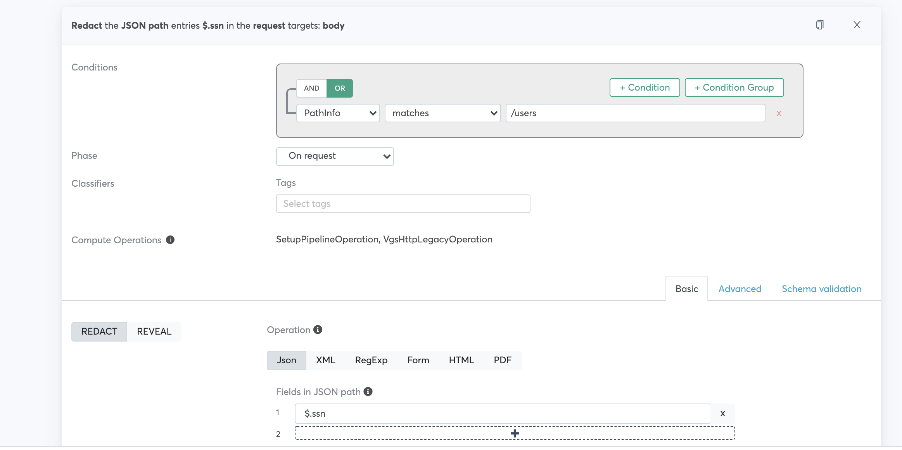
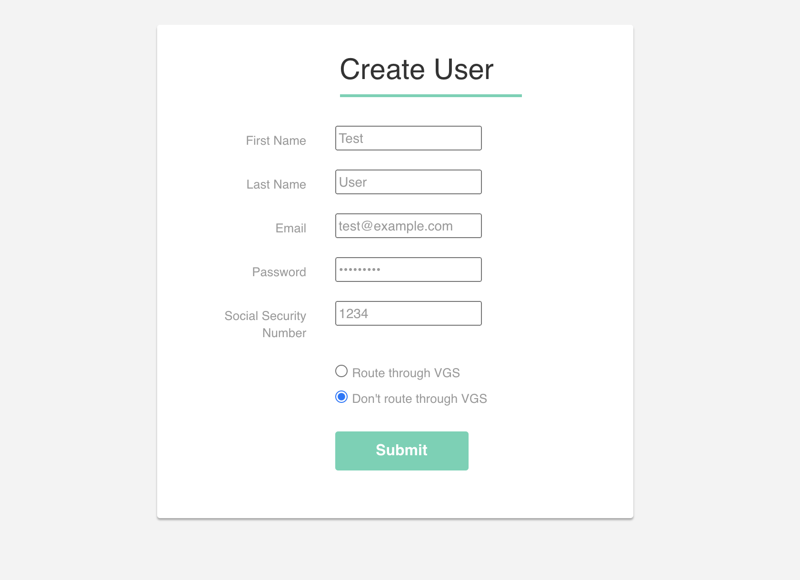
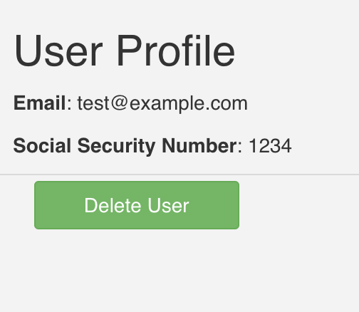
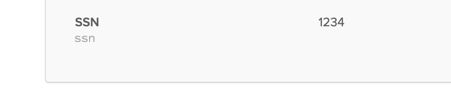
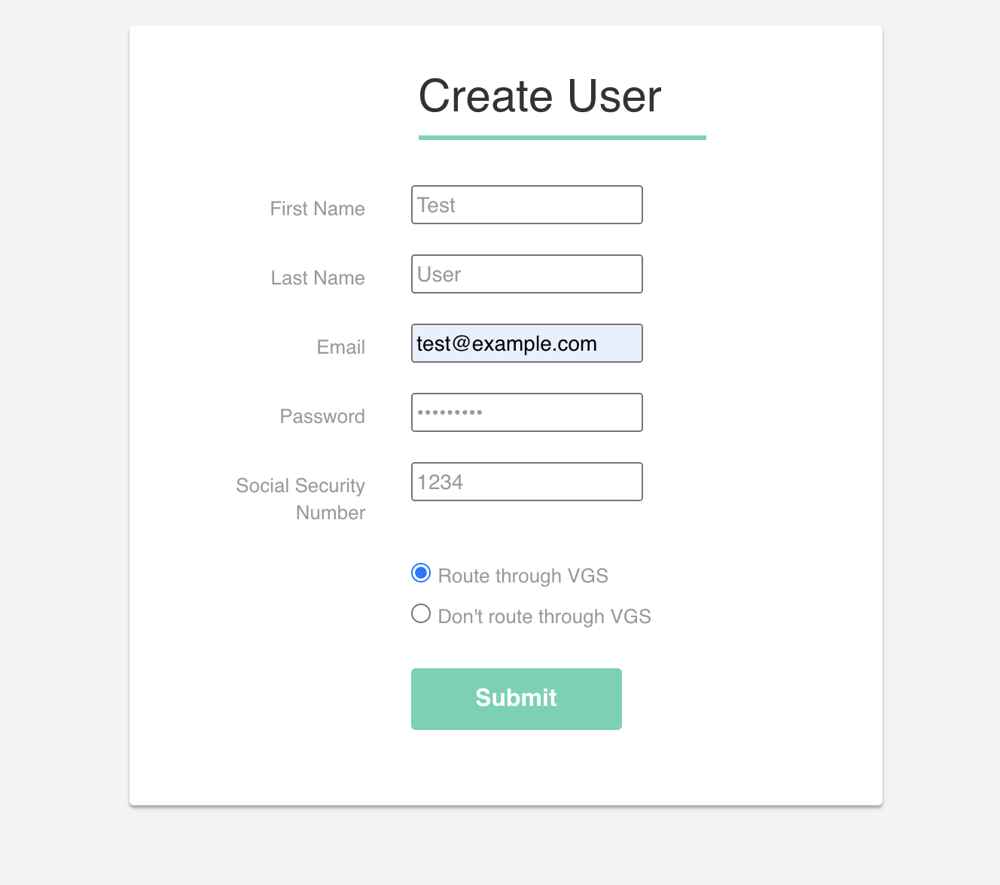
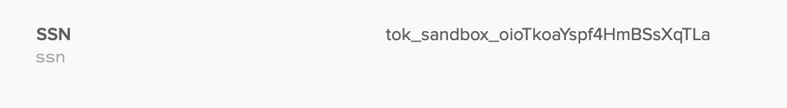

<p align="center"><a href="https://www.verygoodsecurity.com/"></a></p>
<p align="center"><b>Redact PII from Okta</b></p>

This application demonstrates how placing VGS between an application's front end and back end can intercept PII before the back end can send it on to Okta, while still allowing the user to view it later on in the front end.

# Requirements
* A VGS vault
* Docker
* nGrok
* An Okta account, where users have a custom attribute called "ssn"

# Running the Application

* Add your Okta URL and API token to server/app.py. 
* Add your VGS inbound vault URL to client/src/proerties.js 
* In your terminal, run ```docker-compose up -d --force-recreate```
* Next, run ```ngrok http 5000```

## VGS Dashboard Configuration
Set your route's upsteam host to your nGrok URL. Add two filters:

One to readact the SSN before it reaches the server


One to reveal the SSN to the front end upon retrieval from the server


For a quick start, you can use the config.yaml in this project to import a sample route.

### Try it out

Note: This app is intended to demonstrate VGS's capabilities and is not intended to securely handle live data. Do not input a real Social Security Number or any other piece of sensitive data at any point. 

* Open http://0.0.0.0:3000/ in your browser
* First, try creating a user without routing the request through VGS.



* As desired, the user profile displays the SSN you entered. 



* If you look up the user you created in the Okta user directory, you'll notice that the SSN you entered appears unmodified. This is an issue because both your server and Okta have received sensitive data without needing it. Let's fix this.



* Back in your app, click the "Delete User" button
* Create the user again, this time routing through VGS. 



* As before, the user profile displays the SSN you entered. This is because of the reveal filter we added in the VGS configuration.


* However, in the Okta directory, the SSN has been replaced by a VGS token. The redact filter intercepted the real SSN before it made it to the server and replaced it with an alias. The server sent this alias to Okta. Both your server and Okta are now spared the burden of handling sensitive data. 


